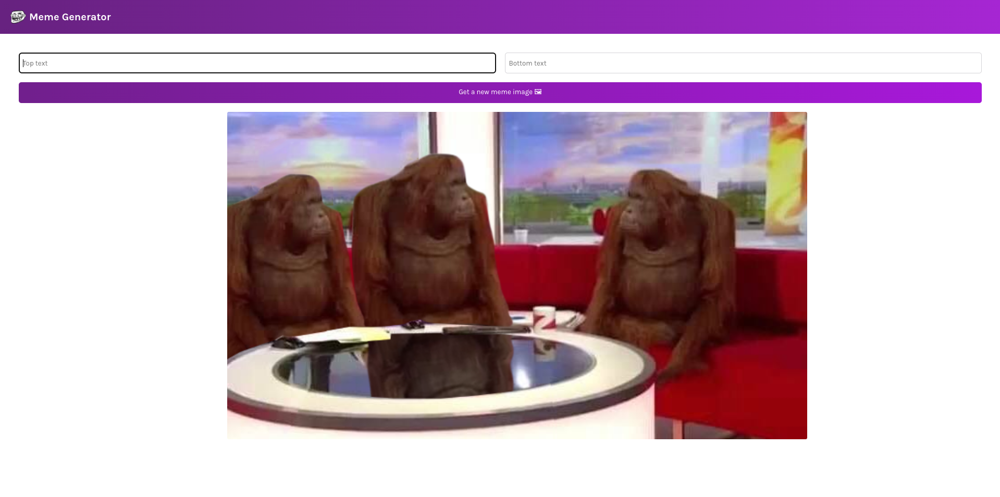

# Meme Generator

This is a web application built using HTML, CSS, JavaScript, and React. It allows users to generate memes by adding captions to popular images.

## Features

- Display a collection of popular images
- Allow users to add custom captions to images
- Responsive design

## Getting Started
These instructions will get you a copy of the project up and running on your local machine for development and testing purposes.

## Prerequisites
- Node.js
- npm

## Installation

1. Clone the repository

`git clone https://github.com/[your_username]/meme-generator.git `

2. Install dependencies

`npm install`

3. Start the development server

`npm start`

## Built With
- HTML
- CSS
- JavaScript
- React

## Author
Nitesh Thapliyal
